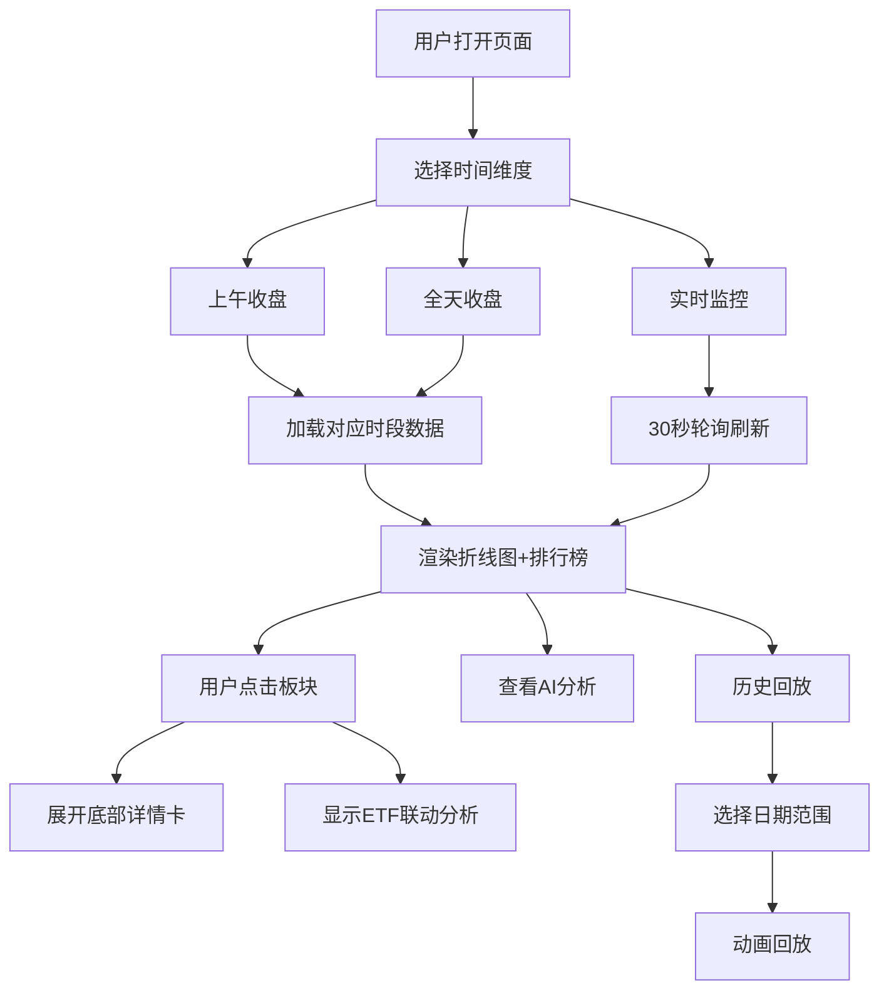

# 板块资金流向动态监控系统 - 产品需求文档

## 1. 产品概述

实时监控A股市场板块（同花顺行业板块、概念板块、东方财富板块）资金流入流出情况，提供上午收盘、全天收盘和实时监控三种视图，并以动态折线图展示。独立功能模块，不与现有投研平台页面联动。

- 目标用户：A股投资者、量化研究员
- 核心价值：直观展示板块资金流向，辅助投资决策

## 2. 核心功能

### 2.1 功能模块

1. **顶部选项卡切换**：上午收盘 / 全天收盘 / 实时监控
2. **左侧主图**：多板块资金净流入动态折线图（ECharts）
3. **右侧排行榜**：资金流入TOP20 + 资金流出TOP20
4. **底部板块详情**：资金结构、涨跌幅、领涨股、ETF联动
5. **AI分析面板**：市场资金分析文本（可折叠）
6. **历史回放**：日期选择器 + 动画回放 + 速度调节

### 2.2 页面详情

| 页面名称 | 模块名称 | 功能描述 |
|----------|----------|----------|
| 板块资金流向 | 顶部导航 | 页面名称显示，右侧选项卡切换（上午/全天/实时） |
| 板块资金流向 | 折线图主图 | ECharts多板块折线图，X轴时间点，Y轴净流入金额（亿元），红涨绿跌 |
| 板块资金流向 | 流入TOP20 | 按主力净流入降序，显示板块名称和金额 |
| 板块资金流向 | 流出TOP20 | 按净流出绝对值降序，显示板块名称和金额 |
| 板块资金流向 | 板块详情卡 | 资金结构、涨跌幅、领涨股、关联ETF联动分析 |
| 板块资金流向 | AI分析面板 | 可折叠卡片，每日市场资金分析文本 |
| 板块资金流向 | 历史回放 | 日期选择、回放动画、速度调节、进度条 |

## 3. 核心流程

## 4. 用户界面设计

### 4.1 设计风格

- 主题：深色金融终端风格，与现有投研平台一致
- 主色：深蓝黑背景 (#060b10)，橙色强调 (#ff6a00)
- 涨跌色：红涨绿跌 (#ff1744 / #00c853)
- 字体：JetBrains Mono（数字）+ Noto Sans SC（中文）
- 布局：左侧70%图表 + 右侧30%排行榜 + 底部详情区
- 圆角：4px-6px，阴影柔和

### 4.2 页面设计概览

| 页面名称 | 模块名称 | UI元素 |
|----------|----------|--------|
| 板块资金流向 | 顶部导航 | 深色导航栏，左侧logo+标题，右侧选项卡按钮 |
| 板块资金流向 | 折线图主图 | 深色背景(0e1622)，红涨绿跌折线，图例交互，悬停数值 |
| 板块资金流向 | 排行榜 | 卡片式列表，排名数字高亮，金额格式化，点击高亮 |
| 板块资金流向 | 板块详情 | 底部卡片展开，资金结构表格，ETF卡片网格 |
| 板块资金流向 | AI分析 | 折叠面板，渐变边框，分析文本 |
| 板块资金流向 | 历史回放 | 日期选择器，播放/暂停按钮，进度条，速度选择 |

### 4.3 响应式

桌面端优先，移动端基本可浏览（图表缩小，排行榜折叠）

## 5. 数据接口

| 接口 | 方法 | 用途 |
|------|------|------|
| /api/sector-flow/rank | GET | 板块排行数据 |
| /api/sector-flow/timeseries | GET | 板块时序数据 |
| /api/sector-flow/realtime | GET | 实时快照 |
| /api/sector-flow/history | GET | 历史回放数据 |
| /api/sector-flow/ai-analysis | GET | AI分析文本 |
| /api/sector-flow/etf | GET | ETF匹配数据 |