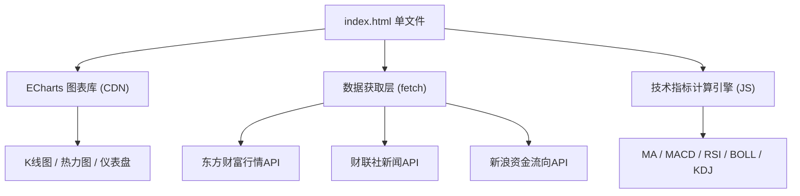

# AI智能投研分析平台 - 技术架构文档

## 1. 架构设计
单HTML文件架构，无后端依赖，纯前端 + 公共API数据源。



## 2. 技术选型
- **前端**：纯HTML5 + CSS3 + Vanilla JS (ES2020)，无框架依赖
- **图表**：ECharts 5.x (CDN)
- **图标**：Lucide Icons (CDN)
- **字体**：JetBrains Mono + Noto Sans SC (Google Fonts CDN)
- **数据**：东方财富/新浪财经/财联社公开API
- **存储**：localStorage（自选股、用户偏好）

## 3. 文件结构
```
d:\营业部分析\
├── terminal.html          # 主平台文件（单文件应用）
├── .trae\documents\
│   ├── prd.md
│   └── tech-arch.md
```

## 4. 数据API定义
| API | 用途 | 方法 |
|-----|------|------|
| 东方财富指数行情 | 获取大盘指数实时数据 | JSONP/fetch |
| 东方财富板块资金 | 获取行业板块资金流向 | JSONP/fetch |
| 东方财富个股K线 | 获取个股日K线数据 | JSONP/fetch |
| 财联社电报 | 获取实时财经新闻 | fetch |
| 新浪财经资金流 | 获取个股资金流向 | fetch |

## 5. 核心计算模块
- **技术指标**：MA(5/10/20/60), MACD(12/26/9), RSI(14), BOLL(20,2), KDJ(9,3,3)
- **量价信号**：放量突破(量>1.5倍均量+价突破MA20)、缩量回调(量<0.6倍均量+价回踩MA10)、金叉死叉
- **资金分析**：主力净流入/流出、板块资金强度排名
- **情绪评分**：基于新闻关键词的简单NLP评分(-1到+1)