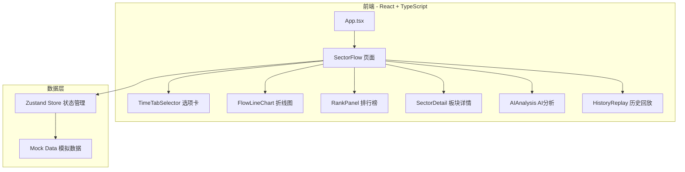

# 板块资金流向动态监控系统 - 技术架构文档

## 1. 架构设计



## 2. 技术描述

- 前端：React 18 + TypeScript + Vite
- 样式：TailwindCSS 3 + Shadcn/UI
- 图表：ECharts 5
- 状态管理：Zustand
- 路由：React Router DOM
- 图标：Lucide React
- 数据：Mock 数据（开发阶段），预留 FastAPI 接口

## 3. 路由定义

| 路由 | 用途 |
|------|------|
| / | 主页（默认重定向到 sector-flow） |
| /sector-flow | 板块资金流向监控页面 |

## 4. API 接口定义

```typescript
// 板块排行数据
interface SectorRankItem {
  name: string;           // 板块名称
  code: string;           // 板块代码
  mainNetInflow: number;  // 主力净流入（亿元）
  superLarge: number;     // 超大单净流入
  large: number;          // 大单净流入
  medium: number;         // 中单净流入
  small: number;          // 小单净流入
  changePercent: number;  // 涨跌幅
  leadingStocks: string[]; // 领涨股
}

// 时序数据
interface TimeSeriesPoint {
  time: string;           // 时间点
  values: Record<string, number>; // 板块名 -> 净流入金额
}

// ETF 数据
interface ETFItem {
  code: string;           // ETF代码
  name: string;           // ETF名称
  changePercent: number;  // 涨跌幅
  volume: number;         // 成交额
  netInflow: number;      // 资金净流入
}
```

### 接口列表

| 接口 | 方法 | 参数 | 返回 |
|------|------|------|------|
| /api/sector-flow/rank | GET | type, period | SectorRankItem[] |
| /api/sector-flow/timeseries | GET | period, sectors | TimeSeriesPoint[] |
| /api/sector-flow/realtime | GET | interval | TimeSeriesPoint |
| /api/sector-flow/history | GET | start, end, sectors | TimeSeriesPoint[] |
| /api/sector-flow/ai-analysis | GET | date | string |
| /api/sector-flow/etf | GET | sector | ETFItem[] |

## 5. 组件结构

```
src/
├── App.tsx                    # 根组件
├── main.tsx                   # 入口
├── index.css                  # 全局样式
├── pages/
│   └── SectorFlow.tsx         # 板块资金流向页面
├── components/
│   ├── TimeTabSelector.tsx    # 时间选项卡
│   ├── FlowLineChart.tsx      # ECharts 折线图
│   ├── RankPanel.tsx          # 排行榜面板
│   ├── SectorDetail.tsx       # 板块详情卡片
│   ├── AIAnalysis.tsx         # AI分析面板
│   ├── HistoryReplay.tsx      # 历史回放控制
│   └── RefreshSelector.tsx    # 刷新间隔选择器
├── store/
│   └── sectorStore.ts         # Zustand 状态管理
├── mock/
│   └── data.ts                # Mock 数据
├── types/
│   └── index.ts               # TypeScript 类型定义
└── utils/
    └── format.ts              # 格式化工具函数
```

## 6. 数据模型

### 板块颜色映射（固定）

| 板块 | 颜色 |
|------|------|
| 储能 | #ef4444 |
| 电力设备 | #dc2626 |
| 通信技术 | #f97316 |
| PCB | #eab308 |
| 光纤 | #84cc16 |
| 机器人 | #06b6d4 |
| AI硬件 | #3b82f6 |
| 算力 | #8b5cf6 |
| 半导体 | #ec4899 |
| 新能源汽车 | #14b8a6 |
| 光伏 | #f59e0b |
| 军工 | #6366f1 |
| 低空经济 | #22c55e |
| 商业航天 | #a855f7 |
| AI应用 | #0891b2 |