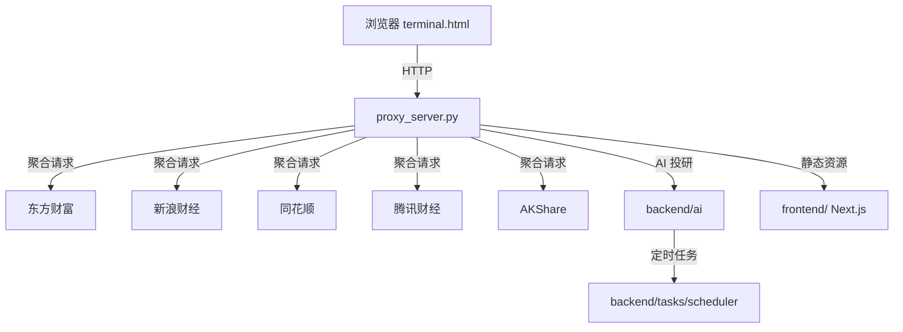

<div align="center">

# 🚀 AI Terminal Pro
## AI 智能投研分析平台

<p>
  
  
  
  
  
</p>

<p>
  <b>🎯 为专业投资者打造的私有化实时金融终端 + AI 多 Agent 投研引擎</b><br>
  <i>一个人也能拥有机构级的量化投研工作台</i>
</p>

<p>
  <a href="#-快速开始">快速开始</a> •
  <a href="#-核心特性">核心特性</a> •
  <a href="#-系统架构">系统架构</a> •
  <a href="#-数据源">数据源</a> •
  <a href="#-免责声明">免责声明</a>
</p>

</div>

---

## 🌟 为什么 AI Terminal Pro 值得你的 Star？

| 痛点 | 传统工具 | AI Terminal Pro |
|------|---------|----------------|
| 数据延迟 | 分钟级延迟 | 多源实时聚合，秒级 failover |
| 数据单一 | 依赖单一数据源 | 东财 + 新浪 + 同花顺 + 腾讯 + AKShare 五源互补 |
| 分析碎片化 | 行情、资金、新闻分散在不同页面 | 一个页面全链路覆盖 |
| 投研效率低 | 手动翻阅研报和公告 | AI 自动生成 9 维度投研报告 |
| 资金流向虚 | 很多"资金流"是估算 | 直接对接东财数据中心真实资金流接口 |
| 私有化部署 | SaaS 产品数据上云 | 完全本地运行，数据不出本机 |

---

## 🎬 一眼看懂

> 打开浏览器，访问 `http://127.0.0.1:8080/terminal.html` 即可进入专业终端

```
┌─────────────────────────────────────────────────────────────────────┐
│  AI TERMINAL PRO                              实时行情 | 智能投研   │
├──────────────┬──────────────────────────────┬───────────────────────┤
│              │                              │                       │
│  市场概览    │       K 线 + 技术指标        │    TradingAgents      │
│  5大指数     │   MA / BOLL / 成交量        │    深度投研报告       │
│              │                              │                       │
├──────────────┤                              ├───────────────────────┤
│              │                              │                       │
│  核心持仓    │     CAPITAL FLOW             │   市场 · 技术 · 舆情  │
│  7只个股     │   主力 / 散户 真实流向       │   基本面 · 政策 · 资金 │
│              │                              │   风险 · 多空 · 决策  │
└──────────────┴──────────────────────────────┴───────────────────────┘
```

---

## 🔥 核心特性

### 📈 1. 彭博 / Wind 级专业终端 UI
- 深色金融风界面，信息密度高、视觉层级清晰
- 卡片式布局，市场概览、持仓、K 线、资金流向、投研分析一屏掌握
- **红涨橙跌**的 A 股专属色彩语义，一眼识别多空
- 响应式滚动设计，大屏 / 笔记本均可流畅使用

### 🌐 2. 真正的实时多源数据聚合
- 同时接入 **东方财富、新浪财经、同花顺、腾讯财经、AKShare**
- K 线、分时、资金流向自动多源 failover，单源失效无缝降级
- 个股资金流直接对接东财数据中心 `RPT_DMSK_TS_FUNDFLOWHIS`
- **真实主力 / 超大单 / 大单 / 中单 / 小单净流入**，拒绝估算

### 🤖 3. TradingAgents 7-Agent 深度投研框架
独创「指数 / 个股独立分析 + 点击切换」的投研面板：

| Agent | 职责 | 输出 |
|-------|------|------|
| 📊 市场概览 | 大盘环境、情绪、成交量解读 | 当日市场定性 |
| 📉 技术分析 | K 线形态、均线、BOLL、支撑压力 | 多空信号 |
| 📰 舆情监控 | 实时新闻、利好 / 利空事件 | 事件驱动清单 |
| 🏢 基本面 | 财务数据、业绩预告、估值分析 | 价值评估 |
| 🏭 政策与行业 | 产业政策、主题催化、产业链逻辑 | 行业景气度 |
| 💰 资金流向 | 主力 / 散户净流入、融资融券、大宗交易 | 资金态度 |
| ⚠️ 风险监控 | 波动、回撤、黑天鹅信号 | 风险提示 |
| ⚖️ 多空辩论 | 自动生成 Bull vs Bear 观点 | 双向逻辑 |
| 🎯 基金经理决策 | 综合评分 + 操作建议 | 加 / 减 / 持有 |

### ⏰ 4. 交易时段智能刷新
- 上午收盘后 **12:00–12:05** 自动生成午间分析
- 下午收盘后 **15:30–15:35** 自动生成日终分析
- 每日重置触发器，确保不重复、不漏发

### 🔄 5. 指数与个股解耦
- 5 大核心指数：上证指数、深证成指、创业板指、沪深 300、科创 50
- 7 只核心持仓股一键切换，独立生成专属投研报告
- 指数面板屏蔽不适用的「主力资金流」，个股面板展示真实主力 / 散户流向

### 🛡️ 6. 鲁棒的后端架构
- 基于 `proxy_server.py` 的轻量级代理服务，绕过浏览器跨域限制
- 内置熔断、限流、缓存与自动重连机制
- 提供 `/api/fundflow/stock` 等 RESTful 数据接口
- `start_server.py` 自动重启守护，服务崩溃后自动恢复

---

## 🏗️ 系统架构



---

## 🚀 快速开始

### 环境要求
- Python 3.10+
- Node.js 18+（可选，运行 Next.js 前端）

### 1. 克隆项目

```bash
git clone https://github.com/XIANGSHIJUE1107/ai-terminal-pro.git
cd ai-terminal-pro
```

### 2. 安装 Python 依赖

```bash
pip install -r backend/requirements.txt
```

### 3. 启动数据代理服务

```bash
# 方式一：直接启动
python proxy_server.py

# 方式二：自动重启守护（推荐）
python start_server.py
```

服务默认运行在：http://127.0.0.1:8080

### 4. 打开终端页面

```
http://127.0.0.1:8080/terminal.html
```

### 5. （可选）启动 Next.js 前端

```bash
cd frontend
npm install
npm run dev
```

---

## 📁 项目结构

```
ai-terminal-pro/
├── backend/                  # Python 后端
│   ├── api/                  # RESTful API 路由
│   ├── data_sources/         # 东财、新浪、同花顺等数据源适配器
│   ├── datahub/              # 数据中枢与缓存
│   ├── services/             # 市场数据服务
│   ├── tasks/                # 定时调度器
│   ├── ai/                   # AI 分析与投研生成
│   └── requirements.txt      # Python 依赖
├── frontend/                 # Next.js 前端（现代化版本）
├── terminal.html             # 主终端页面（即开即用）
├── proxy_server.py           # 数据代理与静态服务
├── start_server.py           # 自动重启守护
├── fund-screening-hd/        # 基金筛选模块
├── README.md                 # 项目说明
└── LICENSE                   # MIT 许可证
```

---

## 📊 数据源

本项目所有数据均来自公开金融数据接口，仅供学习研究使用：

- **东方财富**：行情、K 线、资金流向、融资融券
- **新浪财经**：实时报价、新闻滚动
- **同花顺**：新闻舆情
- **腾讯财经**：K 线 failover
- **AKShare**：A 股 / 全球指数备选数据

---

## 🗺️ 路线图

- [x] 实时行情与 K 线展示
- [x] 真实资金流向接入
- [x] TradingAgents 7-Agent 投研框架
- [x] 收盘后智能刷新
- [ ] 策略回测模块
- [ ] 组合收益跟踪
- [ ] 微信 / 邮件推送
- [ ] 更多技术指标（MACD、KDJ、RSI）

---

## 🙋 适合谁用

- 个人量化研究者
- 股票 / 基金投资者
- 金融数据分析学习者
- 希望搭建私有化投研终端的开发者

---

## 🤝 贡献与社区

如果你认可这个项目，欢迎：

- ⭐ **Star** 本仓库，让更多人发现它
- 🍴 **Fork** 进行二次开发
- 💡 提交 **Issue** 反馈问题或新功能建议
- 🔗 **分享** 给你的投研伙伴

---

## ⚠️ 免责声明

本软件仅供学习研究使用，不构成任何投资建议。金融市场有风险，投资需谨慎。使用本软件所产生的任何盈亏均由使用者自行承担。

---

## 📄 License

本项目基于 [MIT](LICENSE) 许可证开源。

---

<div align="center">
  <b>Made with ❤️ for Chinese Investors</b><br>
  <i>让每一个人都能拥有机构级的投研能力</i>
</div>
